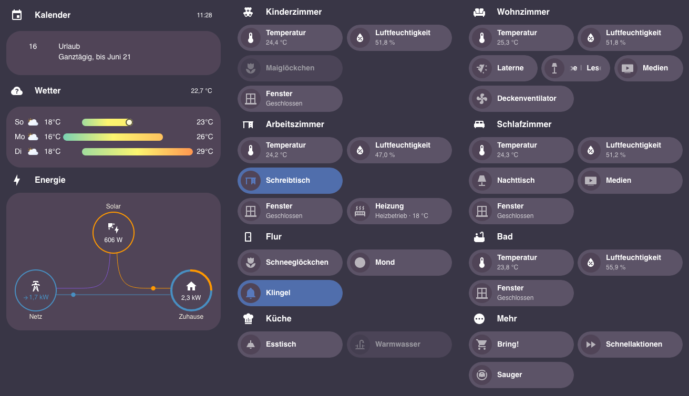

# HA-Dashboard
 This is for the people over at [r/HomeAssistant](https://www.reddit.com/r/homeassistant/). 👋

This dashboard is displayed on a Fire HD 10 in the book shelf in our hallway.




## Prerequisites
- Home Assistant 2024.3 and newer because I used [sections](https://www.home-assistant.io/dashboards/sections/)

### Integrations
- [HACS](https://hacs.xyz/) to install cards, integrations and other custom stuff
- [Time & Date](https://www.home-assistant.io/integrations/time_date/) to display the current time as Sub-button of the calendar separator

### Cards
- [atomic-calendar-revive](https://github.com/totaldebug/atomic-calendar-revive)
- [clock-weather-card](https://github.com/pkissling/clock-weather-card)
- [energy-flow-card-plus](https://github.com/flixlix/energy-flow-card-plus)
- [Bubble-Card](https://github.com/Clooos/Bubble-Card)

### Theme / custom CSS
- [Bubble](https://github.com/Clooos/Bubble)
- [lovelace-card-mod](https://github.com/thomasloven/lovelace-card-mod?tab=readme-ov-file)

## Customizations

Noteworthy customizations I made.

### clock-weather-card
I was looking for a weather card as compact as possible. clock-weather-card was a good start, but with its default settings, it wasn't compact enough for me. I used lovelace-card-mod to add some custom CSS to it. I assume it is pretty hacky, but it works. This is the full YAML for this card:

```
type: custom:clock-weather-card
entity: weather.forecast_home
temperature_sensor: sensor.aussentemperatur
humidity_sensor: sensor.aussentemperatur_2
hide_today_section: true
forecast_rows: 3
card_mod:
  style: |
    ha-card {
      --bar-height: 1em !important;
    }
```

### Conditional coloring for humidity sensors and windows
I was looking for a way to notice high humidity and opened windows at a glance. This was an easy one since Bubble-Card offers [styling](https://github.com/Clooos/Bubble-Card#styling) by default.

This is the custom style I used for humidity:
```
.switch-button {
  background-color: ${state > '64' ? 'indianred' : ''} !important;
}
```

This is the custom style I used for windows:
```
.switch-button {
  background-color: ${state === 'on' ? '#e2aa60' : ''} !important;
}
```

### Hide completed items on To-do list card

Completed items are still displayed in the To-do list card. They can't be hidden by default.


I used lovelace-card-mod to add some custom CSS to it.


This is the full YAML for this card:

```
type: todo-list
entity: todo.zuhause
card_mod:
  style: |
    .completed {
      display: none;
    }
    .header:not([role=seperator]) {
      display: none;
    }
    .divider {
      display: none;
    }
```